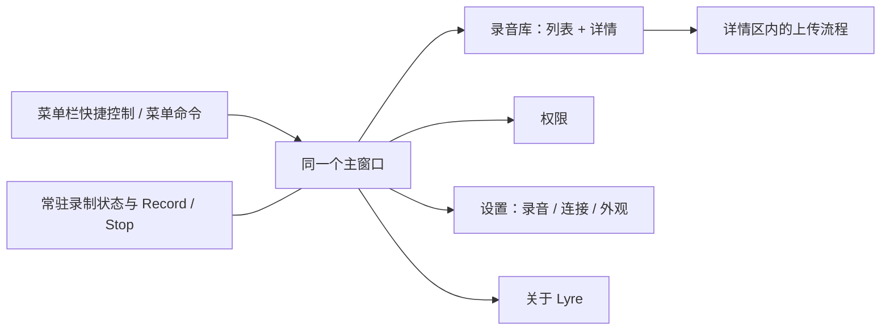

# macOS 单窗口界面改版

本次已经替换 macOS 客户端的界面源码。录音库、权限、设置和关于使用同一个窗口与侧栏，上传进入录音详情区域；全局录制按钮和状态始终留在工具栏。

[查看全部原生界面预览](design/macos-2026-09-15/index.html) · [浅色录音库](design/macos-2026-09-15/screenshots/library-light.png) · [深色录音库](design/macos-2026-09-15/screenshots/library-dark.png)

分析基线：Lyre `main` 已拉取至 `47d8807`，版本 v1.8.1；ShowTime 对照本地 `25a7d6e`，版本 v1.5.0。本轮改版对应 v2.0.0；画廊保留发布前的设计验证截图，验证过程没有替换本机已安装应用。

## 框架比较

两个应用都以 **SwiftUI + AppKit** 构建 macOS 界面。ShowTime 的完成度主要来自窗口组织、组件、字体和间距的一致性，Lyre 可以在现有技术栈内完成这次改版。

| 项目 | Lyre | ShowTime |
| --- | --- | --- |
| 应用界面 | SwiftUI，AppKit 处理窗口、菜单、文件选择等系统交互 | SwiftUI，AppKit 处理窗口、菜单和工作区交互 |
| 构建方式 | XcodeGen + Xcode 工程 | Swift Package Manager |
| Swift | Swift 6，严格并发检查 | Swift 6 工具链，Swift 5 语言模式 |
| 最低系统 | macOS 15 | macOS 14 |
| WebKit 的作用 | macOS 客户端不依赖 WebKit 绘制界面 | 承载浏览器工作区，应用的工具栏和检查器仍是原生界面 |
| 改版前的界面组织 | 600 × 500 默认窗口、四个 Tab、上传 sheet；各页各自设置间距与控件 | Studio 工作区，集中定义主题、按钮、检查器和反馈组件 |
| 可借鉴的实现 | 本次增加小型共享主题与组件，保留原生列表、菜单、表单控件 | `StudioTheme.swift`、`StudioView.swift`、`InspectorView.swift` |

ShowTime 的主题定义了明确的背景、面板、文字、强调色和危险色，并让按钮在不同状态下保持稳定尺寸。它还通过 AppKit 保留真正的 macOS 菜单，并处理 macOS 26 工具栏的额外背景。这些做法被用于 Lyre 的实现；Lyre 延续自己的鸟形图标与暖棕色，而不是复制 ShowTime 的绿色视觉。

ShowTime 的研究入口位于相邻仓库的 `Package.swift` 和 `Sources/Showtime/App/`。仓库内的 `docs/images/showtime.jpg` 是较旧版本图片，框架与实现比较以当前源码为准。

## Monorepo 中的边界

| 目录 | 职责 | 本次变化 |
| --- | --- | --- |
| `apps/web/` | React/Vite 网页，录音管理、转写、播放和总结 | 无 |
| `apps/api/` | Hono Worker，认证、HTTP API 和定时任务 | 无 |
| `packages/api/` | TypeScript 合约、处理器、仓储与服务 | 无 |
| `apps/macos/` | 独立的 Swift 原生录音客户端，通过 HTTP 接入服务 | 窗口、导航、各页面与少量播放辅助逻辑 |

macOS 客户端不直接共享 React 组件或 TypeScript 运行时代码。此次继续使用既有 APIClient、录音管线、上传接口与配置格式，没有引入新的运行时依赖。

## 统一的窗口与导航

`LyreApp` 只声明一个主 `Window`。`MainWindowView` 使用原生 `NavigationSplitView`，固定的导航列依次提供 Recordings、Permissions、Settings 和 About Lyre。

录音页内部采用固定 256 pt 的列表和可伸缩的详情区。该区域使用简单的 `HStack` 与分隔线：原生分栏嵌套在 macOS 26 导航分栏中会重复计算侧栏安全区域，使最小窗口发生横向裁切；当前实现避免了这一问题。主窗口仍保留系统侧栏开关、标题栏、红黄绿按钮和窗口缩放行为。



默认窗口为 1120 × 720；内容设置 960 × 620 的最小约束，系统标题栏可能增加窗口的实际外部高度。设置、权限和长内容在工作区内滚动；详情和上传的主要操作固定在底部。

菜单栏面板保留快捷录制、计时、麦克风、最近录音、Finder 和退出入口。点击录音、设置或权限均回到同一个主窗口。关于和设置没有额外的应用窗口；授权提示、删除确认和系统文件选择继续使用原生系统交互。

## 视觉与控件规则

| 项目 | 实现 |
| --- | --- |
| 颜色 | 暖白／炭灰背景、暖棕／浅杏强调色，录制状态使用独立红色 |
| 标题 | 页标题 26 pt，详情标题 22 pt，正文以系统字体 12–14 pt 为主 |
| 页边距 | 主要页面 28 pt，录音详情与上传 24 pt |
| 普通按钮 | 32 pt 高，共享图标按钮样式为 32 × 32 pt |
| 录制按钮 | 工具栏中固定 144 × 32 pt，开始、停止、等待状态保持同一外框；菜单栏内填满可用宽度 |
| 播放按钮 | 50 pt 圆形主按钮，前后跳转位于两侧 |
| 标签 | 26 pt 高，选中同时显示勾选和颜色 |
| 导航与表单 | 使用原生 List、Picker、Slider、菜单及文本输入，统一文本与操作列的对齐 |
| 外观 | 跟随 macOS、浅色、深色；主窗口和菜单栏共用外观设置 |

材质交给原生导航和标题栏处理，内容区域使用清晰的实体表面。macOS 26 的工具栏背景控制采用编译器和系统版本双重保护；macOS 15 保持可编译的兼容路径。

图标按钮有可访问名称，播放位置提供时间读数，选中标签提供选中语义。录制、权限、上传状态都有文字或图标信息。键盘入口包含 Cmd-R 录制／停止、Cmd-, 设置、Cmd-1 录音库、Cmd-2 权限、Cmd-F 搜索、Space 播放／暂停及原生多选、删除确认。

## 功能与信息的对应关系

| 能力或信息 | 新位置与行为 |
| --- | --- |
| 系统音频 + 麦克风录制 | 所有页面的工具栏与菜单栏，共用既有 RecordingActionController |
| 录制计时、错误与诊断 | 常驻状态；原有录制控制器继续负责错误提示、停止后刷新与麦克风诊断 |
| 录音列表、时长、大小、日期、原始文件名 | 日期分组列表与详情；生成的文件名显示友好的日期时间，完整文件名仍可选择复制 |
| 本地播放 | 详情播放器；选中录音先准备为暂停状态，增加波形、拖动定位和前后 15 秒 |
| 单个／多个删除 | 列表多选、上下文菜单与原生确认；正在上传的文件不能被删除 |
| 上传标题、文件夹、标签 | 详情区的上传表单 |
| 上传准备、进展、失败、重试、取消、成功 | 同一详情区域，操作固定在底部，成功后可打开网页中的录音 |
| 自动上传与时长阈值 | Settings → Recording → Automatic uploads；默认关闭，默认严格超过 5 分钟 |
| 保存位置与 Finder | 常驻侧栏底部、详情与录音设置 |
| 输入设备与系统默认麦克风 | 录音设置和菜单栏共享同一个 Picker，保留保存选择与拔除设备后的回退 |
| Teams 会议提醒 | 录音设置；既有 watcher/coordinator 的启动、挂起和确认逻辑保留 |
| 服务器、设备 Token、连接测试 | Settings → Connection；详情中的 Connect 直接进入该分区 |
| 系统音频和麦克风权限 | Permissions；访问页面只刷新状态，点击授权按钮才请求许可 |
| 版本、构建号、项目、问题反馈、版权 | About Lyre；项目链接修正为 `nocoo/lyre` |
| 空录音库、搜索无结果、多选 | 各自独立的提示与可用操作 |

上传进展按照真实的准备、传输、保存阶段显示。既有传输实现没有连续字节进度，因此界面不再把阶段跳转显示成精确百分比。上传完成后说明需要在网页中开始转写，不宣称自动转写已启动。

连接测试调用原有可达性接口，显示 **Reachable**；设备 Token 的认证由加载文件夹、标签和上传等受保护操作验证，不把可达性显示成登录成功。

## 自动上传

录音设置增加自动上传开关与分钟输入框，可输入或步进调整 1–1440 分钟，默认 **关闭、5 分钟**。配置持久化到现有 JSON 中的 `autoUploadEnabled` 和 `autoUploadMinimumMinutes`；旧配置没有这些字段时仍默认关闭。关闭开关会保留设定时长，并停止后续录音的自动上传；已经开始的上传可在详情中取消。

工具栏、菜单栏和 Teams 提示共用的 `RecordingActionController` 在成功停止录制、完成文件写入并刷新元数据之后触发判断。使用最终音频文件时长，严格大于阈值才上传；恰好 5 分钟、时长未知、文件无法读取或录音保存失败均不会触发。启用设置、刷新列表和重启应用不会补传历史文件。

自动上传使用原始文件名作为标题，不预设文件夹或标签，沿用现有 downmix、上传和创建录音流程。本地原件保留，上传完成后仍由用户在网页中开始转写。后台任务不抢占当前页面、选择和手动上传草稿；如果同一份文件已由用户进入手动上传流程，则尊重手动操作。

列表和详情显示当前应用会话中的自动上传进展、成功或失败。点击 **View upload** 可查看、取消或重试；返回录音或更换目录会保留后台任务。活动上传的文件受到删除保护，包括删除确认期间刚开始的上传。缺少服务器配置时保留可见的失败状态，设置中提供连接入口；自动任务不做静默重试，也不在应用重启后恢复。

## 状态与业务逻辑

[RecordingLibraryState](../apps/macos/Lyre/Views/RecordingLibraryState.swift) 由应用持有，保留选择、搜索、播放器、上传目标和上传草稿。切换到设置或权限不会重建正在进行的上传；更换到空目录也能继续看到原任务。开始另一份上传时使用新的 UploadManager 实例，已取消请求的迟到回调不会覆盖新草稿。

[AudioPlayerManager](../apps/macos/Lyre/Utilities/AudioPlayerManager.swift) 继续用 AVPlayer 播放所有启用的音轨，仅增加暂停准备与安全定位。定位拒绝非有限数值，并限制在有效时长内。

[AudioWaveform](../apps/macos/Lyre/Utilities/AudioWaveform.swift) 在后台用 AVAssetReaderAudioMixOutput 读取全部音轨，以 8 kHz 单声道 PCM 生成固定数量的峰值桶。任务可取消，工作内存有界，不改写原始音频。无法读取时显示实际的不可用状态。

原有录音编码、双音轨写入、上传前 downmix 与 HTTP 请求路径沿用，保留配置与录音文件格式。后续针对权限、输入来源和 Teams 检测进行了[可靠性优化](10-macos-recording-reliability.md)，并将会议提醒、错误和删除确认接入统一对话框设计。

## 验证与复现

本次在 Apple Silicon、macOS 26.6.2、完整 Xcode 环境中验证：

- Debug 测试构建通过；Swift Testing 汇总 **243 个测试定义、参数展开后 263 次通过、0 次失败、3 项跳过**。跳过的是显式关闭的真实录音 E2E 用例。
- Release 构建通过，关闭代码签名用于本地验证。
- SwiftLint strict 通过。现有 SDK 弃用与 `internal(set)` 冗余编译警告仍存在。
- 新用例检查暂停准备、seek 边界、目录更换后的选择与播放状态、活动上传保留和取消请求隔离。
- 自动上传用例覆盖默认关闭、旧配置兼容、时长持久化与有效范围、严格时长边界、无效时长、成功停止后的元数据回调、手动上传并行、取消后的迟到响应隔离及未配置服务器的失败状态。
- 波形用例生成真实双音轨 M4A，第一轨静音、第二轨后半段有声，验证第二轨被读取、音频文件字节保持不变、取消及读取失败。
- 由实际生产 SwiftUI 视图生成 **33 个场景、66 张浅／深色截图**，检查紧凑布局、长文件名、录制按钮、上传流程、输入设备状态、权限拒绝和统一对话框；会议提醒使用实际非激活面板。
- 预览画廊通过浏览器检查：66 张图片可加载，外观切换、场景定位链接、左右键导航正常，1440 和 390 px 视口无横向溢出；Biome 检查通过。

```bash
# 在仓库根目录运行
DEVELOPER_DIR=/Applications/Xcode.app/Contents/Developer bun run test:macos

# 在 apps/macos 目录运行
DEVELOPER_DIR=/Applications/Xcode.app/Contents/Developer \
  swiftlint lint --strict --quiet Lyre/ LyreTests/
```

[预览运行说明](design/macos-2026-09-15/README.md)提供重新渲染和交互查看命令。预览使用隔离配置、合成状态和录音示例；只截取预览进程自己的窗口，不启动真实捕获、Teams 检测或网络上传。

验证未使用真实录音或线上上传，也未在 macOS 15 设备上运行完整交互。最低系统兼容性已通过目标版本和可用性检查进行构建验证。

## 参考

- [Apple：Designing for macOS](https://developer.apple.com/design/human-interface-guidelines/designing-for-macos)
- [Apple：Sidebars](https://developer.apple.com/design/human-interface-guidelines/sidebars)
- [Apple：Toolbars](https://developer.apple.com/design/human-interface-guidelines/toolbars)
- [Apple：Materials](https://developer.apple.com/design/human-interface-guidelines/materials)
- [Apple：Applying Liquid Glass to custom views](https://developer.apple.com/documentation/swiftui/applying-liquid-glass-to-custom-views)
- [Lyre 窗口入口](../apps/macos/Lyre/LyreApp.swift)
- [统一容器](../apps/macos/Lyre/Views/MainWindowView.swift)
- [主题与共享控件](../apps/macos/Lyre/Views/LyreTheme.swift)
- [既有录音管线说明](06-macos-audio-pipeline-redesign.md)
- [既有 Teams 检测说明](07-teams-meeting-detector.md)
